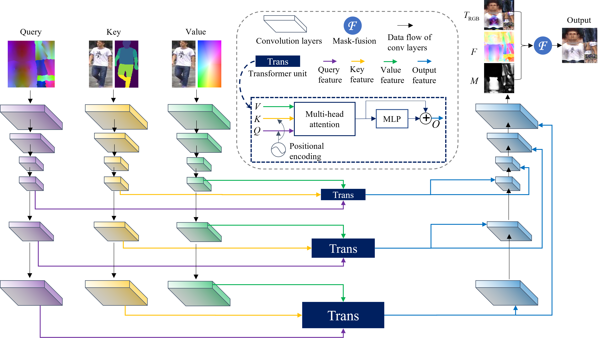

### This is the official implementation of Texformer: ["3D Human Texture Estimation from a Single Image with Transformers", ICCV 2021 (Oral)]()

<br>

## Highlights
* Texformer: a novel structure combining Transformer and CNN
* Low-Rank Attention layer (LoRA) with linear complexity
* Combination of RGB UV map and texture flow
* Part-style loss
* Face-structure loss


## BibTeX
```
@inproceedings{xu2021texformer,
  title={3D Human Texture Estimation from a Single Image with Transformers},
  author={Xu, Xiangyu and Loy, Chen Change},
  booktitle={Proceedings of the IEEE International Conference on Computer Vision},
  year={2021}
}
```


## Abstract
We propose a <b>Transformer-based</b> framework for 3D human texture estimation from a single image. The proposed Transformer is able to effectively exploit the global information of the input image, overcoming the limitations of existing methods that are solely based on convolutional neural networks. In addition, we also propose a mask-fusion strategy to combine the advantages of the RGB-based and texture-flow-based models. We further introduce a part-style loss to help reconstruct high-fidelity colors without introducing unpleasant artifacts. Extensive experiments demonstrate the effectiveness of the proposed method against state-of-the-art 3D human texture estimation approaches both quantitatively and qualitatively.


## Overview


The Query is a pre-computed color encoding of the UV space obtained by mapping the 3D coordinates of a standard human body mesh to the UV space. The Key is a concatenation of the input image and the 2D part-segmentation map. The Value is a concatenation of the input image and its 2D coordinates. We first feed the Query, Key, and Value into three CNNs to transform them into feature space. Then the multi-scale features are sent to the Transformer units to generate the Output features. The multi-scale Output features are processed and fused in another CNN, which produces the RGB UV map $T_\text{RGB}$, texture flow $F$, and fusion mask $M$. The final UV map is generated by combining $T_\text{RGB}$ and the textures sampled with $F$ using the fusion mask $M$. Note that we have skip connections between the same-resolution layers of the CNNs similar to [1] which have been omitted in the figure for brevity.

## Install


## Demo


## Train


## Evaluation


## References
[1] "Learning Spatial and Spatio-Temporal Pixel Aggregations for Image and Video Denoising", IEEE Transactions on Image Processing, 2020.

